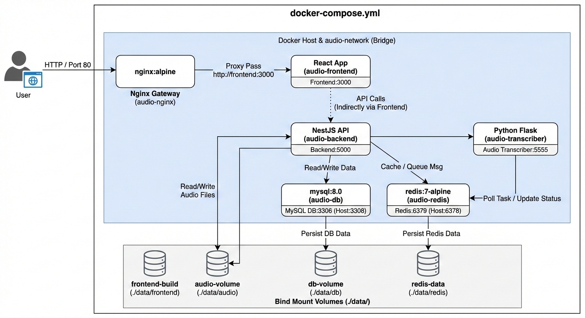

# Live Audio Recording Application

A simple full-stack application for recording high-quality audio from the browser in real-time.

## Architecture



- **Frontend**: React application (port 3000)
- **Backend**: NestJS API with WebSocket support (port 3000)
- **Audio Transcription**: Python Flask service (port 5555)
- **Database**: MySQL (port 3306)
- **Cache**: Redis (port 6379)
- **Reverse Proxy**: Nginx (port 80)

## Prerequisites

- Docker
- Docker Compose

## Getting Started

### 1. Clone the Repository
```bash
git clone <repository-url>
cd live-audio-recording
```

### 2. Setup Environment Variables
```bash
cp .env.example .env
# Edit .env with your settings if needed
```

### 3. Start All Services
```bash
docker-compose up --build
```

This will start:
- Backend API on `http://localhost:5000`
- Frontend on `http://localhost:3000`
- Audio Transcriber on `http://localhost:5555`
- MySQL Database on `localhost:3306`
- Redis on `localhost:6379`

### 4. Access the Application

- **Frontend**: http://localhost
- **Backend API**: http://localhost:5000

## Development

### Running Individual Services

```bash
# Only backend
docker-compose up backend

# Only frontend
docker-compose up frontend

# Only database
docker-compose up db redis

# Only audio transcriber
docker-compose up audio-transcriber
```

### Stopping Services
```bash
docker-compose down
```

### Removing Data (Database)
```bash
docker-compose down -v
```

## Service Details

### Backend (NestJS)
- Handles WebSocket connections for real-time audio streaming
- Manages API endpoints
- Communicates with database and Redis
- Coordinates with audio transcription service

### Frontend (React)
- Records audio from browser microphone
- Streams audio to backend via WebSocket
- Displays real-time status

### Audio Transcription (Python Flask)
- Processes audio files
- Integrates with speech-to-text models
- Stores results in database

### Database (MySQL)
- Stores recorded audio metadata
- Stores transcription results
- Stores user data

### Cache (Redis)
- Session management
- Real-time data caching
- WebSocket message queue

## Environment Variables

See `.env.example` for all available options:

```env
REDIS_HOST=redis          # Redis service name
REDIS_PORT=6379          # Redis port
DB_HOST=db               # Database service name
DB_PORT=3306             # Database port
DB_USER=root             # Database username
DB_PASSWORD=root123      # Database password
DB_NAME=audio_db         # Database name
NODE_ENV=development     # Environment mode
PORT=3000                # Backend port
```

## Troubleshooting

### Services not connecting
1. Check if all containers are running: `docker-compose ps`
2. Check logs: `docker-compose logs <service-name>`
3. Verify network connectivity: `docker network inspect audio-network`

### Database connection errors
```bash
# Restart database service
docker-compose restart db
```

### Port conflicts
If ports are already in use, modify the port mappings in `docker-compose.yml`

### Clearing containers and starting fresh
```bash
docker-compose down -v
docker system prune
docker-compose up --build
```

## Project Structure

```
.
├── backend/              # NestJS API
│   ├── src/             # Source code
│   └── Dockerfile       # Backend container config
├── frontend/            # React application
│   ├── src/             # React components
│   └── Dockerfile       # Frontend container config
├── audio-transcription/ # Python service
│   ├── app/             # Flask application
│   └── Dockerfile       # Transcription container config
├── nginx/               # Reverse proxy config
├── docker-compose.yml   # Service orchestration
└── .env.example         # Environment template
```
